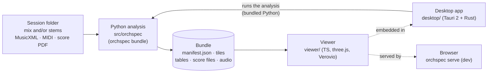
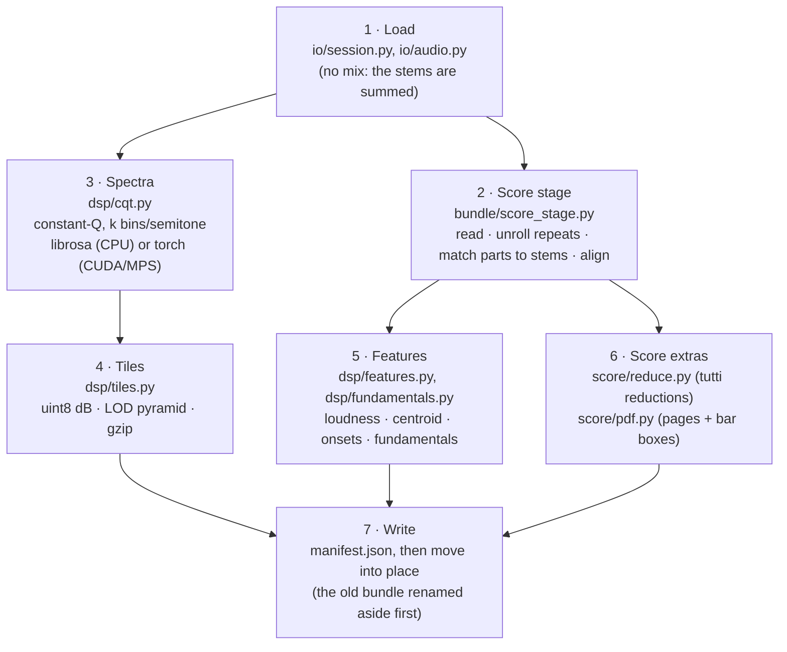
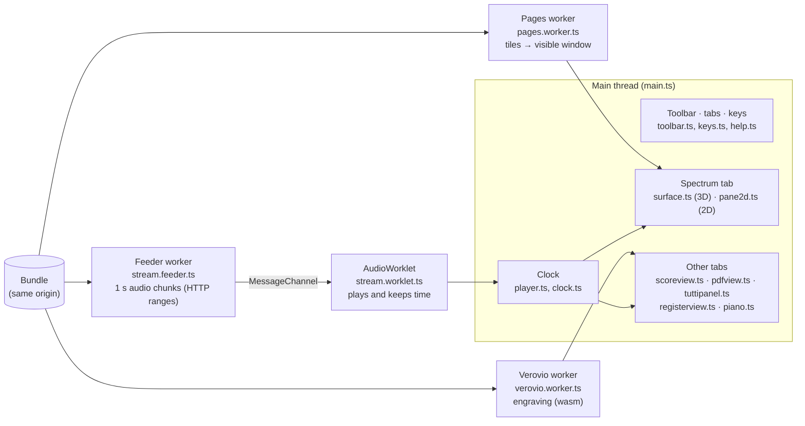
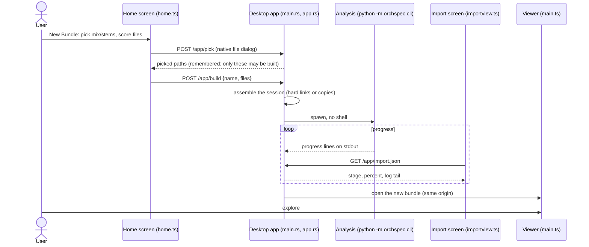

# Architecture

orchspec has three parts joined by one file format: a Python analysis core writes a
**bundle**, and a TypeScript viewer shows it, either in a browser or inside the Tauri
desktop app.



- **The bundle** is the contract between the parts ([bundle-format.md](bundle-format.md)).
  It is written once by Python and read by TypeScript and Rust. The schema (v7) is
  defined in three places that must change together: `src/orchspec/bundle/schema.py`
  (normative), `viewer/src/bundle.ts` and `rust/orchspec-core/src/manifest.rs`. Tests
  cross-check them.
- **Local-only by construction**: no network at run time, a strict CSP, loaders that take
  paths only, and localhost-only serving with a token. [SECURITY.md](../SECURITY.md) lists
  the guarantees and the tests that enforce them.

## Repository layout

```
src/orchspec/          Python analysis core (package `orchspec`, CLI `orchspec`)
viewer/                TypeScript viewer (Vite, three.js, Verovio in a worker)
rust/orchspec-core/    Rust: manifest, tiles, serving rules, session import, app helpers
desktop/               Tauri 2 desktop shell (src-tauri/) embedding viewer/dist
scripts/               credits generation, desktop runtime build and packaging
tests/                 pytest suites + fixture generators (synthetic sessions, PDFs)
docs/                  format and user documentation
data/instruments/      instrument ranges (ranges.yaml)
PLAN.md                roadmap, decisions, approved dependencies
CLAUDE.md              commands and invariants for contributors (and coding agents)
```

## Python analysis (`src/orchspec`)

`orchspec bundle` (`cli.py`) runs `bundle/writer.py:build_bundle`:



1. **Load** (`io/session.py`, `io/audio.py`): validate the session and read the audio.
   Stems must match each other's sample rate and length. Without a mix, the stems are
   summed into a temporary one.
2. **Score stage** (`bundle/score_stage.py`):
   - read MusicXML safely with defusedxml (`score/musicxml.py`) or the MIDI
     (`timeline/midi.py`), and unroll repeats (`score/repeats.py`);
   - match parts to stems by name (`score/match.py`) and add instrument ranges
     (`score/ranges.py`);
   - **align** score time to audio seconds (`timeline/align.py`): MIDI tempo map, then a
     global offset from onset cross-correlation, then a warp over snapped onsets, with
     per-part latency.
3. **Spectra** (`dsp/cqt.py`): a constant-Q transform on a MIDI-aligned axis, k bins per
   semitone from A0. It has two backends: librosa (CPU) and torch (CUDA/MPS/CPU; the
   same axis within tolerance, see `tests/test_torch_vs_librosa.py`).
4. **Tiles** (`dsp/tiles.py`): quantise dB to uint8, build a level-of-detail (LOD)
   pyramid, and write gzip tiles on a thread pool.
5. **Features** (`dsp/features.py`, `dsp/fundamentals.py`): short-term loudness, spectral
   centroid, onset envelopes, and the level at each note's fundamental (or audio-only f0
   tracks when there is no score).
6. **Score extras**:
   - engravable reductions for the tutti view, per bar or per beat, all parts or by
     section (`score/reduce.py`);
   - the score PDF rendered to page images, with bar boxes found by staff and barline
     detection plus the PDF's text layer (`score/pdf.py`).
7. **Write** the manifest, then move the finished bundle into place. An existing bundle is
   renamed aside first, so a failure never leaves a half-written one.

Parallelism, with output identical to a sequential build:
- On the CPU backend, worker threads analyse several stems at once (CQT, onset
  envelopes); results are taken in stem order (`test_cpu_workers_build_equals_single_thread`).
- With torch, the score stage and features run in background threads alongside the stem
  loop (`test_parallel_build_equals_sequential`).

`orchspec report` (`report.py`) turns the alignment's assumptions into PASS/WARN checks.
`orchspec serve` (`server.py`) serves one bundle and the built viewer on 127.0.0.1 with a
random port and token (for development; the desktop app replaces it).

## Viewer (`viewer/src`)

The viewer is a single page. Heavy work runs off the main thread, and every fetch is
same-origin (`net.ts`).



One frame (`renderer.setAnimationLoop` in `main.ts`): read the clock, update the page
window, then draw only the open tab. The spectrum (3D, 2D pane, loudness strip) is not
drawn while another tab covers it.

| Module | Role |
|---|---|
| `main.ts` | Wires everything: the tabs, the frame loop, and the views. |
| `bundle.ts` | Parse and validate the manifest (the TS side of the schema). |
| `tiles.ts`, `pagesclient.ts`, `pages.worker.ts` | Fetch and decompress tiles off the main thread, and build the visible time window ("page") with stem sums, smoothing and register folding. |
| `surface.ts`, `colormap.ts` | The 3D surface (three.js, WebGL2). |
| `pane2d.ts`, `notes.ts`, `gaps.ts` | The 2D pane, note outlines, spectral gaps. |
| `player.ts`, `stream.feeder.ts`, `stream.worklet.ts`, `streamqueue.ts`, `clock.ts`, `wav.ts` | Streaming playback. A worker fetches 1 s audio chunks with HTTP range requests and feeds an AudioWorklet over a MessageChannel. The worklet's position is the clock. |
| `scoreview.ts`, `verovio.worker.ts`, `verovioCore.ts`, `scoremap.ts` | The engraved score (Verovio in a worker), the score↔audio time map, and following playback system by system. |
| `pdfview.ts` | Following a score PDF (page images and bar boxes). |
| `tuttipanel.ts`, `condense.ts` | The tutti view: engraved reductions, selection, condensing, pitch-class sets, section colours (mixed or split). |
| `orchchart.ts`, `bubbletail.ts` | The chord pop-up: an orchestration chart (sections, labels, collision-free leader lines, hover highlighting) and its pointer to the selection. |
| `registers.ts`, `registerview.ts` | Register distribution. |
| `piano.ts`, `heat.ts` | Piano view and keyboard heat. |
| `home.ts`, `importview.ts` | Desktop home screen and New Bundle wizard; import progress. |
| `toolbar.ts`, `splitter.ts`, `hovertip.ts`, `help.ts`, `keys.ts`, `busy.ts` | Folding toolbar groups, resizable panels, hover help, the Help view, keyboard shortcuts, spinners. |
| `a11y.ts` | Accessible mode (WCAG 2.2 AA). |
| `net.ts` | The same-origin fetch guard (no network beyond the page's own origin). |

Unit tests are `*.test.ts` (vitest), and `e2e/viewer.spec.ts` runs Playwright against a
real build.

## Rust (`rust/orchspec-core`, `desktop/`)

- `manifest.rs`: the manifest (schema v1–7) with the same rules as `schema.py`.
- `tiles.rs`: tile read/write and the LOD pyramid. It is cross-checked against
  Python-written bundles.
- `serve.rs`: the serving rules as pure functions: path confinement, no hidden files,
  GET/HEAD only, byte ranges, and the security headers.
- `session_import.rs`: import status, parsing the CLI's progress lines, and locating the
  analysis (`find_cli`: the bundled runtime, else a development checkout).
- `app.rs`: the home screen's data: listing bundles, recent files, and assembling a
  session from the files picked in the wizard.

The desktop app (`desktop/src-tauri/src/main.rs`):
- **Serving:** one custom protocol serves the embedded viewer and the opened bundle from
  the same origin, so the viewer's CSP and fetch guard work unchanged.
- **Isolation:** there are no IPC capabilities, and navigation is locked to that origin.
  The home screen talks to the app through a few same-origin `/app/` routes instead.
- **Import:** runs the analysis CLI as a subprocess, with no shell, and kills it when the
  app exits. Installed builds use the bundled Python runtime; see
  [development.md](development.md#desktop-builds).



## Tests and CI

| Workflow | Runs |
|---|---|
| `ci.yml` | Ruff, pyright and pytest on Windows (plus macOS on main); viewer lint, unit tests and build; Playwright E2E on Linux; Rust fmt, clippy and tests. |
| `desktop.yml` | Clippy for the desktop shell on Windows (a full build on main). |
| `supply-chain.yml` | pip-audit, npm audit, cargo-deny. |
| `release.yml` | Installers on version tags: Windows CPU (NSIS) and macOS Apple silicon (.dmg), attached to a draft release. |

pytest markers: `gpu` (needs CUDA), `slow` (performance), and `real` (your own sessions
in the git-ignored `session/`).
